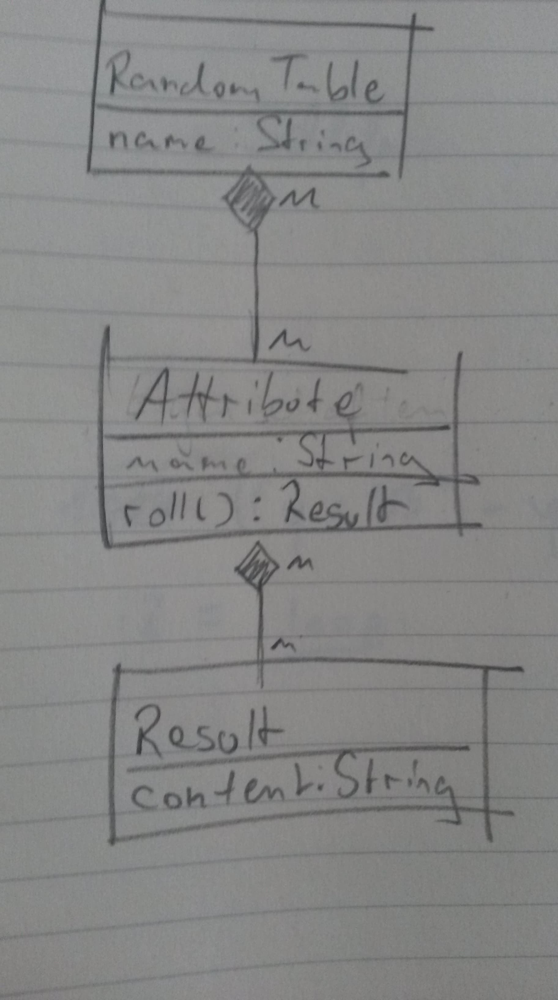

# RPGRTG

## Motivation

Es gibt 'ne Menge Random Tables [\[1\]](https://www.reddit.com/r/BehindTheTables/) und Würfelwerfer [\[2\]](https://chartopia.d12dev.com/en/search/)[\[3\]](https://autorolltables.github.io/) im Internet. Allerdings fehlen mir bei allen Tools, die ich mir bisher angeschaut habe, zwei Features:

* __Personalisierung der Würfelergebnisse:__ Narben über dem Auge sind auch noch beim 70. Mal mysteriös, aber vielleicht nicht mehr so kreativ. Es wäre cool, wenn man ein gewürfelte Eigenschaft als verwendet markieren könnte und der Algorithmus die Wahrscheinlichkeiten gewichtet. Außerdem könnte man damit noch Verwendungsstatistiken erheben, aber das ist optional.
* __Feingranualität:__ Rennautos, aber auch fremde Planeten sind gelegentlich rot. Beim Erstellen von neuen Eigenschaften sollte es möglich sein, deren Ergebnisse an verschiedene Eigenschaften zu binden. Diese Eigenschaften sollten wiederum zu verschiedene Roll Tables gehören.     

Es wäre also cool, ein Tool zu schreiben, dass diese Features beinhaltet. Insbesondere weil keine der Einzelaufgaben wirklich komplex ist. Es ist mehr ein Software Engineering Problem als eine algorithmische oder technologieabhängige Aufgabe.

## Anforderungen

Das Ziel dieses Projektes soll es sein ein Tool zu erstellen, dass neben den eben genannten Features folgende Funktionalität aufweist:

1. Ein einfaches Einlesen von großen Mengen an human readable Eigenschaften und Würfelergebnissen mit einer sinnvollen Verlinkung untereinander und zu Random Tables. Es soll sowohl möglich sein einfach ein File einlesen zu lassen als auch übers CLI neue Würfelergebnisse für schon existierende Eigenschaften zu schreiben.
2. Erstellung von Random Tables, die eine Menge von Eigenschaften aufweisen, auf denen man würfeln kann. Hier hätte ich gerne erstmal einfach nur ein CLI, aber in der Zukunft wäre bspw. auch ein Web-Service vorstellbar. (HINT HINT)

## Offene Fragen

* Sprache? (scalascalacsclalcac)
* Das Einlesen von Eigenschaften, das generieren von Random Tables und das tatsächliche Ausführen eines Random Tables sind verschiedene Programme. Ist diese Aussage korrekt?
* Sinnvolle Trennung von Personalisierung und Ergebnissen?  
* Input-Format?
* Output-Format? (proly JSON)
* Wie sollen Eigenschaften im Speicher repräsentiert werden?  

## Ein mögliches Klassendiagramm

Das Programm soll also beispielsweise Modelle der folgenden Form generieren:

